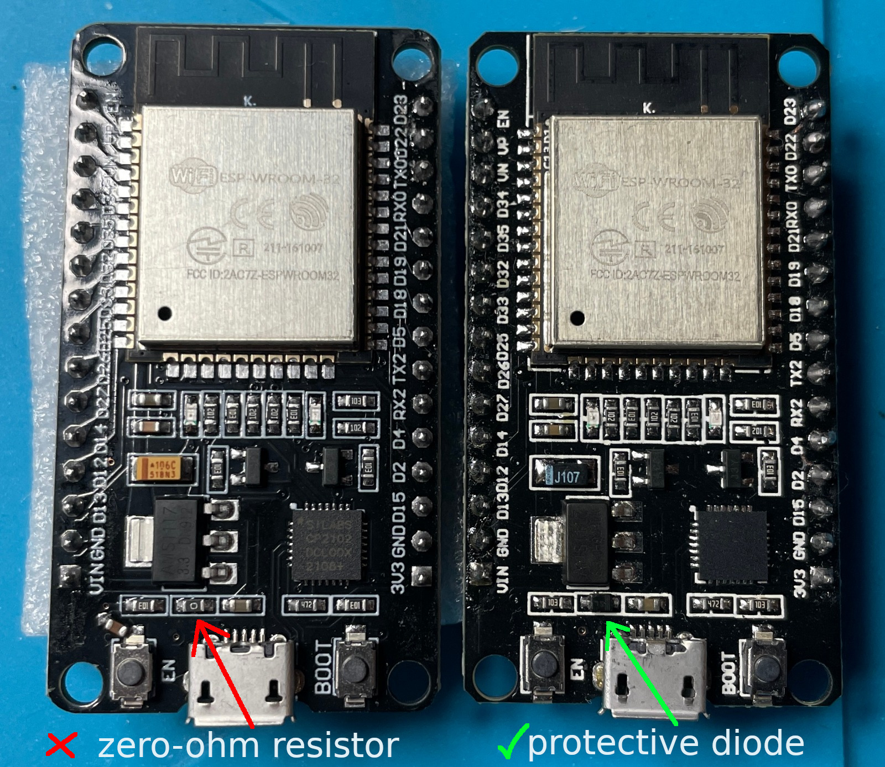

# wic64-firmware

Firmware for the WiC64, an ESP32 based Commodore 64 userport adapter that
allows the C64 to send and receive HTTP requests and to communicate with
remote hosts via TCP.

This is the second generation of the WiC64 firmware, conceptually based on
and extending previous work by Sven "KiWi" Arke.

To clone this repository, use

```bash
git clone --recursive git@github.com:WiC64-Team/wic64-firmware.git
```

If you have already cloned this repository without specifying
`--recursive`, use

```bash
git submodule init
git submodule update
```

## Bulding the firmware

### Installing ESP-IDF and setting up the build environment

This project uses the ESP-IDF framework version 4.4.6 by Espressif.

Follow the instructions in section ["Setting up Development
Environment"](https://docs.espressif.com/projects/esp-idf/en/v4.4.6/esp32/get-started/index.html#setting-up-development-environment)
from Espressifs "Get Started" guide to install the framework and build
environment for your platform.

Once the development environment is set up, enter the wic64-firmware
directory and run

```bash
idf.py build
```
This will create the binary image at `./build/wic64.bin`

> [!NOTE]
> ESP-IDF Version 4.4.6 is used instead of the current stable 5.x version
> because at the time of writing, the arduino-esp32 core used in this
> project is not yet compatible with ESP-IDF versions above 5.x.

## Precautions before connecting the WiC64 to your PC via USB

> [!CAUTION]
> Make sure to read this section carefully *before* connecting the WiC64 to
> your PC

**This section only applies if you connect the WiC64 to a PC via USB while
it is *also plugged into the C64 userport*.**

The Esp32 breakout board used on the WiC64 is an `ESP32 DOIT Devkit v1`
board, a common design that has been used by many different manufacturers.
This board can either be powered via its USB socket, or from an external
power source. When used on the WiC64, the board is powered by the C64
userport.

In order to see the WiC64 log messages while the WiC64 plugged into the
C64, you need to additionally connect the ESP32 board to a PC using an USB
cable. Once you do this, the ESP32 board is powered from two separate
sources simultaneously. This **should** not be a problem since the
**original design** of the DOIT board features a protective blocking diode
that prevents power from the USB port to flow back into the external power
source, effectively isolating both sources from each other.

Unfortunately, some of the `ESP32 DOIT Devkit v1` boards available on the
market **do not conform to the original design** and have **replaced the
the blocking diode with a 0-Ohm resistor**.

**If** the ESP32 board on your WiC64 happens to lack the protective
blocking diode, you **must not** connect the board to a PC via USB while
the WiC64 is also plugged into the C64 userport. If you do so, the power
from the USB port will flow back into the C64 and not only **blow the C64s
internal fuse**, but also potentially **damage other parts of your C64**.

Therefore, before you connect the WiC64 to the C64 and a PC at the same
time, you first need to carefully check your ESP32 board and determine
whether it actually features the proper protective diode.

Here is a picture of two different boards, with the left board mistakenly
featuring a zero-ohm resistor, and the right board properly featuring a
protective diode:



Note that a zero-ohm-resitor might not always be labeled with a zero. If in
doubt, use a multimeter to test whether the part is a diode or a
zero-ohm-resitor by checking continuity in both directions. A diode only
conducts power in one direction.

If your board has a zero-ohm-resitor instead of a diode, you have the following options:

- Replace the resistor with a suitable SOD-323 schottky diode, for example the [NXP PMEGXX10BEA](https://www.reichelt.de/schottkydiode-40-v-1-a-sod-323-pmeg-4010bea-nxp-p219552.html).
- Use a "data only" USB cable that does not connect the USB power line
- Use a regular USB cable with addtional adapter that excludes the USB power line, for example this [USB Power Blocker](https://restore-store.de/home/673-usb-power-blocker.html).

## Connecting the WiC64 to your PC

> [!CAUTION]
> Make sure to read the previous section to avoid potential damage to the
> WiC64 and/or your C64

Connect the WiC64 to your PC via USB. The ESP will be registered as a
serial terminal device.

On Linux this should create the device node `/dev/ttyUSB<n>`, e.g.
`/dev/ttyUSB0`, `/dev/ttyUSB1` or similar. The actual device name can be
determined by looking at the output of the `dmesg` command. Look for a line
similar to `usb 3-10.3: cp210x converter now attached to ttyUSB0`.

On Windows, the device should be registered as a COM device, for example
`COM0`, `COM3` or similar. To determine the actual device descriptor, open
the Windows Device Manager and look for an entry similar to `Silicon Labs
CP210x USB to UART Bridge (COM3)`.

## Flashing the firmware

Once you have build the firmware, you can flash it to the WiC64 using the
following command:

```
idf.py -P <port> flash
```
Where `<port>` is the linux device node path or the windows COM device
descriptor as described in the previous section.

Note that you can also set the environment variable `ESPPORT` to avoid
having to specify the serial device each time you invoke `idf.py`.

Invoke `idf.py` without arguments to see a list of all supported commands
and options. Note that you can specify multiple commands as well, for
example

```
idf.py build flash monitor
```

Will build the firmware, flash it to the ESP and then start montoring the
ESPs log output immediately.

## Monitoring log output

> [!CAUTION]
> Make sure to read [Precautions before connecting the WiC64 to your PC via USB](#precautions-before-connecting-the-wic64-to-your-pc-via-usb) to avoid potential damage to the WiC64 and/or your C64

In case you have set up ESP-IDF on your machine, using `idf.py monitor` is
the recommended way to monitor the ESP32 log, since this method is
integrated with the ESP-IDF build system and automatically maps raw stack
addresses back to the corresponding source locations. Press `Ctrl-t`
followed by `Ctrl-h` to see a list of additional commands.

If you don't want to set up ESP-IDF just for this, you should be able to
simply point any serial terminal program to the ESPs serial device. If you
need to specify a baud rate, use `115200`.

On Linux, the simplest way is to run `cat /dev/ttyUSB0`. Alternatively you
can use any of the various terminal programs availabe, like `minicom`,
`picocom` or `tio`.

On Windows, [PuTTY](https://www.putty.org/) is a popular choice. Open a
PuTTY session and choose "Serial" as the connection type, enter the device
descriptor in the field "Serial line" and enter a baud rate of `115200`.

## Changing the log level

After reboot the WiC64 log level is set to `WARN` by default, which will
only show errors or warnings. To show more detailed information, you can
change the log level at runtime by pointing your browser to
`http://<wic64-ip-address>/`. This will show a simple web page from which
you can choose the desired log level:

|Level|Description|
|-----|-----------|
|NONE|no log messages|
|ERROR|only errors are reported|
|WARN|only errors and warnings are reported|
|INFO|shows brief information about commands being executed|
|DEBUG|shows more detailed information, including crucial handshakes|
|VERBOSE|shows even more details, including hexdumps of headers and payloads|

The web page will also allow you to permanently disconnect the WiFi
connection until the next reset. You can also perform a factory reset,
erasing all configuration data from flash. These options are mainly
intended for debugging.

## Writing programs for the WiC64

For further information on how to write programs for the WiC64 see
[wic64-library](https://github.com/WiC64-Team/wic64-library).
